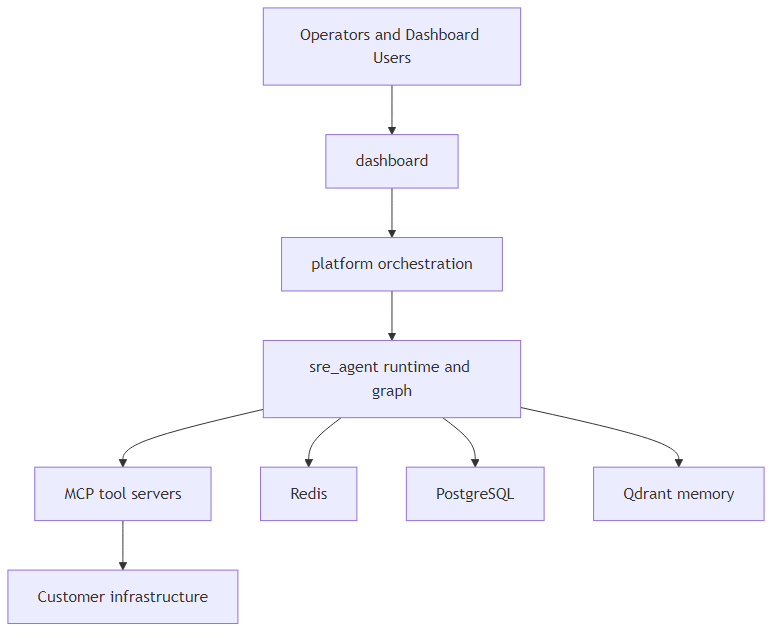
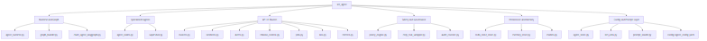
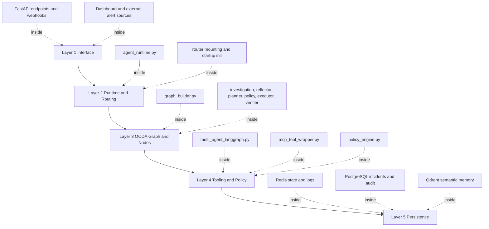
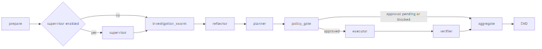
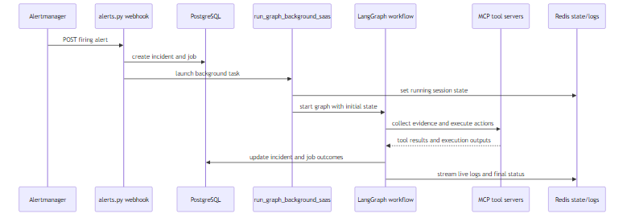
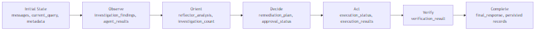
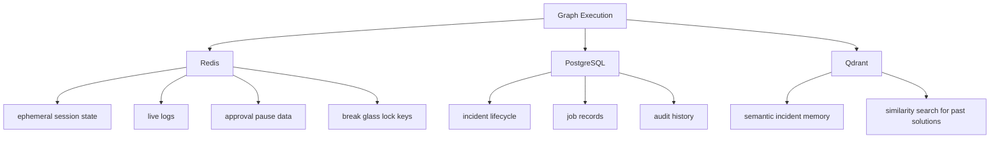

# SRE Agent Detailed Guide

This document is a complete introduction and technical reference for the `sre_agent` folder.
It is written for someone who is new to this folder and wants both:

- an easy conceptual understanding of what this system does
- practical details needed to run, debug, and extend it safely

This guide is intentionally long and structured in steps so you can read it in phases instead of all at once.

## If Mermaid Is Not Rendering

Some markdown viewers (or plain editor view) show Mermaid source text instead of visual diagrams.
If that happens, use the fallback diagrams below.

### Image Files

For direct viewing, here are the generated PNG images of the architecture:

- [Repo Role Hierarchy](sre_agent/diagrams/repo-role-hierarchy.png)
- [Internal Hierarchy](sre_agent/diagrams/internal-hierarchy.png)
- [Layered Architecture](sre_agent/diagrams/layered-architecture.png)
- [Graph Transition Flow](sre_agent/diagrams/graph-transition-flow.png)
- [Incident Sequence](sre_agent/diagrams/incident-sequence.png)
- [State Evolution](sre_agent/diagrams/state-evolution.png)

### Mermaid Source Files

If you need raw Mermaid diagrams directly, use these standalone files:

- [sre_agent/diagrams/repo-role-hierarchy.mmd](sre_agent/diagrams/repo-role-hierarchy.mmd)
- [sre_agent/diagrams/internal-hierarchy.mmd](sre_agent/diagrams/internal-hierarchy.mmd)
- [sre_agent/diagrams/layered-architecture.mmd](sre_agent/diagrams/layered-architecture.mmd)
- [sre_agent/diagrams/graph-transition-flow.mmd](sre_agent/diagrams/graph-transition-flow.mmd)
- [sre_agent/diagrams/incident-sequence.mmd](sre_agent/diagrams/incident-sequence.mmd)
- [sre_agent/diagrams/state-evolution.mmd](sre_agent/diagrams/state-evolution.mmd)

You can copy any file content into Mermaid-compatible renderers without extracting code blocks from this README.

---

## Step 1: Understand What This Folder Is

The `sre_agent` folder contains the AI and control logic for the SRE platform. Think of it as the operational brain that receives incident signals, investigates them through tools, decides on remediations, and verifies whether the issue is fixed.

At a high level, this folder provides:

- the FastAPI runtime used by the platform API process
- the LangGraph multi-step investigation graph
- agent node logic for Kubernetes, logs, metrics, runbooks, and code-change analysis
- policy controls and approval flow
- persistence helpers for Redis and vector memory
- API endpoints for incidents, jobs, approvals, and telemetry

A practical mental model is:

- `platform/` orchestrates containers and infrastructure services
- `sre_agent/` implements the AI workflow and APIs that use those services

### Diagram: Repo Role Hierarchy

This diagram clarifies where `sre_agent` sits relative to platform orchestration and external systems.



If you remember only one thing: this folder is not a small helper package. It is the application behavior layer for incident investigation and remediation planning.

---

## Step 2: Build a Mental Model Before Reading Code

Before opening files one by one, it helps to understand the execution pattern used across the system.

The system follows an OODA-style flow:

- Observe: collect evidence from tools in parallel
- Orient: analyze and correlate findings
- Decide: build a remediation plan
- Act: run policy checks and execute actions
- Verify: measure outcomes and determine if resolved

That means the code is organized around phases, not just utilities. You will see this reflected in:

- state schema (`agent_state.py`)
- graph and routing (`graph_builder.py`)
- node implementation (`agent_nodes.py` plus phase nodes in `graph_builder.py`)
- runtime execution and API integration (`agent_runtime.py`)

The biggest beginner mistake is to treat each file independently. Instead, read this folder as one pipeline where state flows through nodes.

---

## Step 3: Quick Start Paths (Choose One)

This section gives two practical paths.
Use Path A if you want to see full platform behavior. Use Path B if you want to focus only on local agent development.

### Path A: Run full platform stack (recommended for first-time understanding)

Use this path if you want all dependencies running together.

```bash
cd platform
./start.sh
```

Why this helps:

- you get PostgreSQL, Redis, Qdrant, the edge MCP stack, API, and dashboard together
- the runtime assumptions in `sre_agent` match this setup closely

What to check after startup:

- API docs available at `http://localhost:8080/docs`
- dashboard available at `http://localhost:3002` (container maps 3002 -> 3000)

### Path B: Run only SRE agent runtime for dev iteration

Use this path if you are changing logic and want faster restarts.

```bash
uvicorn sre_agent.agent_runtime:app --reload --port 8080
```

Why this helps:

- faster edit-run cycle
- easier to trace one codepath at a time

Important caveat:

- this mode still expects configured dependencies and MCP endpoints to work for full behavior

---

## Step 4: Glossary and Core Concepts

This section is the foundation for everything else. If terms feel abstract, revisit this section after Step 8.

### 1) Agent State

`AgentState` is a shared typed dictionary passed through graph nodes. It is the main data contract across the workflow.

Key idea:

- nodes do not return a completely new world
- nodes usually return partial updates
- LangGraph merges updates into the running state

This pattern keeps nodes focused and composable.

### 2) Investigation Swarm

The swarm phase triggers specialized agents for different evidence domains.

Typical domains:

- Kubernetes topology and health
- metrics and golden signals
- logs and error patterns
- GitHub changes for code correlation
- runbook lookup for known remediation patterns

Even when called a swarm, execution behavior can be constrained by practical concerns like rate limits.

### 3) Reflector

The reflector synthesizes findings and creates a hypothesis with confidence.
It can route back to deeper investigation if confidence is low or gaps exist.

Think of it as:

- quality-control reasoning layer
- not just summarization

### 4) Planner

The planner translates hypothesis into structured remediation actions.
It tries to use runbooks and memory context when available.

Planner output includes:

- ordered actions
- safety notes
- rollback guidance
- risk level and approval requirements

### 5) Policy Gate

Policy gate is deterministic safety logic. It checks actions against environment and risk constraints before execution.

Important operational point:

- this is where risky actions are blocked or paused for approval

### 6) Executor

Executor maps remediation actions to tools and performs calls.
Execution is protected by wrappers (retry, circuit breaker, audit logging).

### 7) Verifier

Verifier re-queries metrics after remediation delay and decides if incident is resolved.
It can inspect threshold comparisons and golden signal status.

### 8) MCP

MCP (Model Context Protocol) is the tool interface layer. The agent discovers and calls tools exposed by MCP servers.

In this repo, MCP servers cover domains such as:

- Kubernetes
- Prometheus metrics
- Loki logs
- GitHub
- runbooks
- memory (incident recall)

### 9) Break Glass Lock

A cluster lock mechanism can block execution actions during emergency controls.
This protects infrastructure when operators want immediate stop behavior.

---

## Step 5: Folder and File Map

Now that concepts are grounded, this section maps important files to responsibilities.

### Diagram: Internal Hierarchy in `sre_agent`

This hierarchy view shows how files group into architectural responsibility zones.



### Core runtime and orchestration

| File | Purpose | Why it matters |
|---|---|---|
| `agent_runtime.py` | FastAPI app startup, endpoint wiring, background graph execution | Main process entry point for API and investigation flow |
| `graph_builder.py` | Graph construction and OODA phase nodes | Defines workflow transitions and control logic |
| `agent_nodes.py` | Specialized domain agents and tool-filtered execution | Implements domain-specific evidence gathering |
| `supervisor.py` | Routing and response aggregation behavior | Controls fallback/legacy routes and final synthesis |

Explanation:

- If you need to understand request-to-graph flow, start at `agent_runtime.py`.
- If you need to understand how state moves between phases, focus on `graph_builder.py`.
- If you need to change how specific evidence is gathered, work in `agent_nodes.py`.

### State and schemas

| File | Purpose | Why it matters |
|---|---|---|
| `agent_state.py` | Pydantic models plus shared `AgentState` TypedDict | Defines canonical data flowing through nodes |
| `constants.py` | central model/timeouts/prompt/app constants | Prevents hardcoded values spread across code |

Explanation:

- Changes to state shape should be done carefully to avoid node contract breakage.
- Read `agent_state.py` before adding fields in nodes.

### Tool integration and reliability

| File | Purpose | Why it matters |
|---|---|---|
| `multi_agent_langgraph.py` | MCP URI loading, tool discovery, graph creation | Connects agent runtime to tool ecosystem |
| `mcp_tool_wrapper.py` | retry + circuit breaker + audit wrapping | Critical for resilient tool execution |
| `config/agent_config.yaml` | maps agents to allowed tools | Enforces scoped tool usage by agent |

Explanation:

- Tool failures are expected in distributed systems. Wrapper behavior determines graceful degradation.
- If an agent cannot call a tool, verify the YAML tool mapping before changing code.

### Persistence and context

| File | Purpose | Why it matters |
|---|---|---|
| `redis_state_store.py` | session state, logs, approval TTL, cluster lock | Core for approval pause/resume and live logs |
| `memory_store.py` | Qdrant-backed semantic incident memory | Supports recall of similar incidents and solutions |
| `models.py` | SQLAlchemy audit model(s) inside sre_agent domain | Links execution to persisted audit records |

Explanation:

- Redis supports short-lived operational state.
- Qdrant supports semantic memory.
- PostgreSQL supports durable incident/job/audit records.

### Prompt and model layer

| File | Purpose | Why it matters |
|---|---|---|
| `prompt_loader.py` | loads base and role prompts with templating and cache | prompt consistency and maintainability |
| `llm_utils.py` | provider creation with helpful error handling | cleaner provider switching and diagnostics |

Explanation:

- Prompt bugs can look like logic bugs. Keep prompt loading explicit and testable.
- Provider errors are normalized for better troubleshooting.

### API surface (`api/v1`)

| File | Purpose |
|---|---|
| `clusters.py` | cluster CRUD, health, lock, audit listing |
| `incidents.py` | incident listing and manual incident trigger |
| `alerts.py` | Alertmanager webhook ingestion |
| `jobs.py` | cluster job trigger/list APIs |
| `mission_control.py` | incident logs, status, approve endpoint |
| `slos.py` | SLO create/list/status/delete |
| `metrics.py` | metrics snapshot endpoint for dashboard telemetry |
| `auth_deps.py` | shared JWT user dependency |

Explanation:

- The runtime includes routers from here and mounts them under specific prefixes.
- When debugging route behavior, check both the router file and how it is mounted in `agent_runtime.py`.

---

## Step 6: Runtime Architecture and Flow

This section shows the operational path from startup to graph completion.

### Diagram: Layered Architecture

This layered view shows how requests move through interfaces, orchestration, and storage/tool boundaries.



### Startup flow

At process startup, `agent_runtime.py`:

- loads environment variables
- configures logging and CORS
- mounts API routers
- initializes Redis state store
- initializes multi-agent graph depending on mode and token conditions

Important startup behavior:

- provider is read from `LLM_PROVIDER`
- graph is built through `create_multi_agent_system(...)`
- MCP tools are discovered during initialization

### Graph flow (simplified)

```text
prepare -> (optional supervisor) -> investigation_swarm
investigation_swarm -> reflector -> planner -> policy_gate
policy_gate -> executor OR aggregate (if pending approval)
executor -> verifier -> aggregate -> END
```

### Diagram: Graph Transition Flow

This transition diagram mirrors the graph routing semantics and pause paths.



This shape is intentionally deterministic at phase level, while each phase can call probabilistic LLMs and external tools.

### OODA-to-node mapping

- Observe: `investigation_swarm`
- Orient: `reflector`
- Decide: `planner`
- Act: `policy_gate`, then `executor`
- Verify: `verifier`
- Complete: `aggregate`

Why this matters:

- operators can reason about which phase failed
- logs and UI can map current node to incident lifecycle

---

## Step 7: End-to-End Walkthrough (Alert to Resolution)

This is the most important beginner section. It connects files, state, tools, and persistence in one narrative.

### Diagram: End-to-End Incident Sequence

This sequence focuses on control-plane orchestration from webhook to completion.



### Scenario

A monitoring system sends an Alertmanager webhook for a firing alert.

### Sequence walkthrough

1. Webhook ingestion

`api/v1/alerts.py` receives `POST /api/v1/alerts/webhook`.
It validates cluster token, parses alerts, deduplicates open incidents, creates incident and job records, then launches background investigation via `run_graph_background_saas`.

Why this design helps:

- ingestion stays fast and async-friendly
- heavy investigation work moves to background execution

2. Background orchestration starts

`run_graph_background_saas` updates incident/job status in PostgreSQL and prepares initial graph state.
State includes query text, metadata (cluster, incident, tools), session id, and user context.

3. Investigation phase

`investigation_swarm` gathers evidence from domain agents.
Each agent receives focused query context and uses tool subset defined by configuration.

Evidence targets include:

- Kubernetes runtime health
- service metrics
- logs
- recent code changes

4. Reflection phase

`reflector` builds hypothesis and confidence from findings.
If confidence is low, it can request deeper investigation loopback.

5. Planning phase

`planner` creates remediation plan with actions, risk level, and verification metrics.
It tries runbook search and memory recall so recommendations can reuse prior successful patterns.

6. Policy gate

`policy_gate` checks deterministic rules against action list and environment.

Possible outcomes:

- approved: continue to executor
- pending approval: pause and await operator approval
- blocked/failed path: aggregate with safe completion status

7. Execution phase

`executor` maps actions to tools and runs them only when approved.
Before execution, it checks cluster emergency lock.

Execution safety layers:

- retry for transient errors
- circuit breaker for repeated tool failures
- audit log entry for traceability

8. Verification phase

`verifier` re-checks metrics and compares against threshold and baseline values.
It computes improvement percentage and determines resolved vs failed status.

9. Completion and persistence

Final summary and structured result are written to incident/job records.
Live logs and session updates are available via Redis-backed state endpoints.

### Why this sequence matters for debugging

When incidents look wrong, inspect by phase:

- wrong alert parsing: webhook layer
- weak diagnosis: reflector and planner prompts/state
- unsafe action behavior: policy gate
- no tool effect: executor and wrappers
- false resolved/failed: verifier query logic

---

## Step 8: API Documentation for This Folder

This section focuses on routes defined in `sre_agent` and how they are used.

### Runtime-level utility endpoints

- `GET /ping`
  - purpose: health check endpoint for runtime and container checks

- `GET /agent/state`
  - purpose: active investigations and pending approvals summary

- `GET /agent/state/{session_id}`
  - purpose: session-level live status and logs

- `POST /approve/{session_id}`
  - purpose: resume paused remediation after approval

- `POST /webhook/alert`
  - purpose: self-defense mode webhook route with local/cluster-aware behavior

### Router-backed business endpoints

Mounted via runtime with prefixes.

1) Alerts

- `POST /api/v1/alerts/webhook`
  - receives Alertmanager payload, creates incidents/jobs, starts background investigation

2) Clusters

- `POST /api/v1/clusters`
- `GET /api/v1/clusters`
- `GET /api/v1/clusters/{cluster_id}/health`
- `DELETE /api/v1/clusters/{cluster_id}`
- `GET /api/v1/clusters/{cluster_id}/lock`
- `POST /api/v1/clusters/{cluster_id}/lock`
- `GET /api/v1/clusters/{cluster_id}/audit`

3) Incidents

- `GET /api/v1/clusters/{cluster_id}/incidents`
- `POST /api/v1/clusters/{cluster_id}/trigger`

4) Jobs

- `POST /api/v1/clusters/{cluster_id}/jobs/trigger`
- `GET /api/v1/clusters/{cluster_id}/jobs`

5) Mission control

- `GET /api/v1/incidents/{incident_id}/logs`
- `GET /api/v1/incidents/{incident_id}/status`
- `POST /api/v1/incidents/{incident_id}/approve`

6) SLOs

- `POST /api/v1/clusters/{cluster_id}/slos`
- `GET /api/v1/clusters/{cluster_id}/slos`
- `GET /api/v1/clusters/{cluster_id}/slos/{slo_id}/status`
- `DELETE /api/v1/clusters/{cluster_id}/slos/{slo_id}`

7) Metrics snapshot

- `GET /metrics/snapshot`

### API auth pattern

Most business routes use shared dependency in `api/v1/auth_deps.py`:

- bearer JWT decoded
- user looked up in database
- org-based checks enforced in route logic

Why this matters:

- route-level behavior often combines auth dependency plus org ownership checks
- if a route returns 404 for valid ids, ownership mismatch is a common reason

---

## Step 9: State Model Deep Dive

Understanding `AgentState` is required before changing graph nodes.

### Diagram: State Evolution Across Phases

This state evolution map helps explain which fields become populated at each phase.



### Main field groups

1. Conversation and phase control

- `messages`
- `ooda_phase`
- `next`

2. Investigation outputs

- `investigation_findings`
- `reflector_analysis`
- `remediation_plan`
- `execution_results`
- `verification_result`

3. Operational metadata

- `metadata`
- `agents_invoked`
- `thought_traces`
- `investigation_count`

4. Identity and memory context

- `session_id`
- `incident_id`
- `cluster/user identifiers`
- memory capture/context fields

### Why partial updates are used

Each node usually returns only changed fields. That reduces coupling and makes node logic simpler.

Example conceptual pattern:

- reflector should not rewrite unrelated fields from swarm
- verifier should not reconstruct planner output

### Compatibility notes

The state includes some legacy fields for backward compatibility with older flows. Do not remove them casually without tracing usage in runtime and UI endpoints.

---

## Step 10: Tooling and Reliability Model

This section explains how tool calls are made reliable enough for production-like behavior.

### MCP tool discovery

`multi_agent_langgraph.py` reads MCP endpoint URIs from environment variables.
Configured URIs can include domains such as k8s/logs/metrics/runbooks/github/memory.

If no MCP URI is available, system initialization can fail.

### Wrapper stack around tool calls

Tools are wrapped in this order:

1. retry
2. circuit breaker
3. audit logging

This sequencing means:

- transient failures are retried first
- persistent failures can open breaker to stop repeated pressure
- final outcomes are always audited

### Retry behavior

Uses exponential backoff with limited attempts.

Practical effect:

- network jitter and short server hiccups become survivable
- failure mode becomes controlled rather than immediate hard-stop

### Circuit breaker behavior

If a tool fails repeatedly above threshold, calls are blocked during cooldown.

Practical effect:

- prevents repeated expensive failures
- allows recovery attempts after cooldown interval

### Structured error strategy

Tool failures can be converted into structured messages so downstream phases can continue with degraded data.

Practical effect:

- incident pipeline can still produce diagnosis from available evidence
- reflector can acknowledge missing domains instead of crashing whole run

---

## Step 11: Safety and Human Approval

Safety in this folder is not a single check. It is layered.

### Policy layer

`policy_engine.py` enforces deterministic rules based on:

- action type
- environment
- risk score and thresholds
- specific action parameters (for example scale replicas)

Typical blocked patterns include production-risky operations without explicit safety conditions.

### Approval layer

Even when actions are valid structurally, plan can require approval and pause execution.

Pause behavior includes:

- state written to Redis with TTL
- remediation plan available for mission control UI
- resume endpoint path for approved continuation

### Emergency lock layer

Executor checks cluster lock (break glass). If locked, execution is aborted even if plan is approved.

Why this is useful:

- operators can enforce immediate no-change mode during critical uncertainty

### Safety design takeaway

This architecture treats safe automation as:

- deterministic controls first
- human override path second
- execution only after explicit gate outcome

---

## Step 12: Persistence Model (Redis, PostgreSQL, Qdrant)

This folder uses multiple stores for different operational needs.

### Diagram: Persistence Responsibilities

This diagram clarifies why persistence is split instead of unified in one database.



### Redis

Used for:

- short-lived approval and session state
- live log streams for active executions
- cluster lock keys

Why Redis:

- low-latency access
- TTL support for ephemeral workflow state

### PostgreSQL

Used for:

- durable incident/job lifecycle updates
- audit logs and historical records
- dashboard-facing persistence

Why PostgreSQL:

- relational consistency for multi-tenant control plane data

### Qdrant

Used for:

- semantic memory and similar incident recall
- embedding-based incident retrieval

Why Qdrant:

- vector similarity for contextual memory beyond exact matching

### Design principle

The stores are intentionally specialized:

- Redis for now-state
- PostgreSQL for system-of-record
- Qdrant for semantic history

---

## Step 13: Configuration You Must Know

Configuration drives behavior strongly in this folder. Many issues are config mismatches, not code bugs.

### LLM provider variables

Common variables:

- `LLM_PROVIDER`
- provider-specific API keys (`GROQ_API_KEY`, `GOOGLE_API_KEY`)
- optional local model variables (for ollama)

### MCP URI variables

Common variables:

- `MCP_K8S_URI`
- `MCP_LOGS_URI`
- `MCP_METRICS_URI`
- `MCP_RUNBOOKS_URI`
- `MCP_GITHUB_URI`

### Infrastructure variables

Common variables:

- `REDIS_URL`
- `DATABASE_URL`
- `QDRANT_URL`
- `PROMETHEUS_URL`

### Safety and verifier tuning variables

Examples used in code:

- policy restart risk threshold
- circuit breaker threshold and recovery window
- verifier wait seconds
- golden signal threshold values

### Practical advice

When behavior looks inconsistent across environments:

- compare environment variables first
- compare mounted MCP URIs second
- compare runtime mode (`AGENT_MODE`) and token context third

---

## Step 14: Debugging and Operations Playbook

This section is designed for real incidents where you need fast diagnosis.

### A) Startup fails before serving requests

Likely causes:

- invalid or unavailable LLM provider credentials
- no MCP URIs configured
- database/redis/qdrant service unavailable

Checks:

- verify env variables
- check container health in full stack mode
- inspect runtime logs for provider-specific error messages

### B) Webhook accepted but no investigation progress

Likely causes:

- background task launch failure
- graph initialization failed
- missing tool access in agent config

Checks:

- incident and job status in database
- live session logs via `/agent/state/{session_id}`
- log line progression by node name

### C) Investigation runs but produces weak diagnosis

Likely causes:

- one or more domain tools unavailable
- insufficient data returned by tools
- prompt quality or provider response quality

Checks:

- reflector logs for tool-unavailability notices
- tool wrapper audit logs for repeated failures
- domain agent outputs in state

### D) Policy gate keeps pausing unexpectedly

Likely causes:

- plan risk level high
- production environment inferred from labels
- plan requires approval by design

Checks:

- policy evaluation metadata in state
- action list and risk score calculation
- environment labels in alert context

### E) Execution approved but no action happens

Likely causes:

- break glass lock active
- tools missing from metadata
- executor action-to-tool mapping mismatch

Checks:

- cluster lock endpoint value
- execution status/result payload
- audit logs for tool invocation attempts

### F) Verifier marks failed even after fix

Likely causes:

- query construction mismatch
- threshold parsing issues
- verification wait too short

Checks:

- verifier generated PromQL query
- threshold source in annotations/labels
- configured wait seconds and rerun behavior

---

## Step 15: How to Extend the System Safely

This section gives a practical checklist for adding features without destabilizing production behavior.

### Add a new domain agent

1. Implement or adapt node behavior in `agent_nodes.py`.
2. Add tool mapping in `config/agent_config.yaml`.
3. Register node and transitions in `graph_builder.py` as needed.
4. Ensure state fields needed by the new agent exist in `agent_state.py`.
5. Add or update prompt templates in `config/prompts` and loader references.
6. Test with degraded-tool scenarios as well as happy path.

Why this checklist matters:

- many extension bugs come from missing one of these linkage points

### Add a new remediation action type

1. Extend action handling in planning/executor logic.
2. Add policy evaluation rules for safe environments.
3. Add fallback behavior when required tool is unavailable.
4. Add audit fields if action requires extra traceability.

Why this checklist matters:

- introducing action types without policy updates is a common safety gap

### Add a new MCP tool server domain

1. Expose new URI variable.
2. Include URI in MCP config loader.
3. Ensure discovery and wrapper pipeline includes the tool.
4. Update agent tool mappings so relevant agents can access it.
5. Add troubleshooting notes and health checks for new domain.

Why this checklist matters:

- discovery alone is not enough; authorization and mapping must also align

### Add API routes

1. Create route in `api/v1` with auth dependency when needed.
2. Mount router in runtime with proper prefix.
3. Add ownership checks for org-scoped resources.
4. Add response models and error handling.
5. Add docs and examples for dashboard/integration consumers.

Why this checklist matters:

- route exists in file does not mean route is active until mounted

---

## Step 16: Testing and Verification Strategy

Even if dedicated test files are still growing, this folder can be validated systematically.

### Unit-level focus areas

- policy rule evaluation behavior
- risk score calculations
- state merging assumptions in nodes
- tool wrapper behavior (retry and circuit breaker)

### Integration-level focus areas

- MCP discovery with real/partial tool availability
- webhook to incident/job creation and background launch
- approval pause and resume behavior
- verifier query and status output

### Failure-injection checks

Run intentional failures to verify graceful handling:

- disable one MCP server
- return invalid/malformed tool response
- force high-risk plan and confirm policy pause
- lock cluster and confirm executor abort

### Observability checks

For each run, confirm traceability exists in:

- runtime logs
- Redis session logs
- PostgreSQL audit trail
- incident/job final status records

---

## Step 17: Common Newcomer Questions

### Why are there both `alerts.py` webhook route and runtime webhook route?

The code supports multiple operational modes and integration paths.
One route is in API router structure and another supports self-defense flow directly in runtime. Both exist to support different deployment and trigger patterns.

### Why keep both Redis and PostgreSQL logs?

Redis is fast for in-flight updates and temporary session state. PostgreSQL is durable and queryable for audit/history and dashboard cards.

### Why not execute actions directly after planning?

Because safety is first-class. Policy and approval gates prevent high-risk automatic changes in production contexts.

### Why does tool failure not always stop the whole run?

This is deliberate graceful degradation. In incident response, partial evidence is often better than no response when some subsystems are unavailable.

### Why can there be loops back to investigation?

The reflector can request deeper investigation when confidence is low. This improves diagnosis quality and avoids premature action.

---

## Step 18: Suggested Reading Order for New Contributors

If you are joining development on this folder, follow this order:

1. Read this document through Step 8.
2. Read `agent_state.py` in full.
3. Read `agent_runtime.py` startup and background execution functions.
4. Read `graph_builder.py` beginning to end with focus on nodes and edges.
5. Read `agent_nodes.py` and `config/agent_config.yaml` together.
6. Read `multi_agent_langgraph.py` and `mcp_tool_wrapper.py` together.
7. Read `policy_engine.py` and `redis_state_store.py`.
8. Finally inspect each `api/v1` router according to your feature area.

This order reduces confusion because it follows execution flow instead of alphabetical file order.

---

## Final Summary

The `sre_agent` folder is a full incident automation engine, not a simple utility package.
Its architecture combines:

- phase-driven graph orchestration
- domain agents using MCP tools
- deterministic safety controls
- approval and emergency lock mechanisms
- multi-store persistence for realtime and historical needs

If you are completely new, the key to mastering this folder is to think in phases and state transitions, then map each file to where it contributes in the lifecycle.

When in doubt, debug by phase:

- ingestion
- investigation
- reflection
- planning
- policy
- execution
- verification

That approach will help you isolate issues quickly and extend the system confidently.

---

## Appendix A: Practical Command Snippets

These commands are convenience references for day-to-day work.

### Run runtime directly

```bash
uvicorn sre_agent.agent_runtime:app --reload --port 8080
```

### Start full stack

```bash
cd platform
./start.sh
```

### Check API health

```bash
curl http://localhost:8080/ping
```

### Trigger webhook locally (example shape)

```bash
curl -X POST http://localhost:8080/webhook/alert \
  -H "Content-Type: application/json" \
  -d '{"alerts":[{"labels":{"alertname":"HighErrorRate","severity":"critical"},"annotations":{"description":"Error rate exceeded"}}]}'
```

Note:

- real production webhook flow may require token-auth route under `/api/v1/alerts/webhook`

---

## Appendix B: Safe Change Checklist Before Merge

Use this short checklist whenever modifying `sre_agent` behavior.

- Verify state fields added or changed are consumed safely by all affected nodes.
- Verify graph edges still allow successful completion paths.
- Verify policy checks remain deterministic and explicit.
- Verify executor paths handle approval and cluster lock conditions.
- Verify wrapper stack still applies retry, breaker, and audit logging.
- Verify new env vars are documented and defaults are sensible.
- Verify mission control and status endpoints still reflect run progress.
- Verify degraded-tool scenario still returns meaningful output.

This checklist helps preserve reliability while the system evolves.
